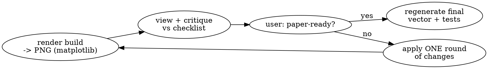

# Composing paper figures

## Overview

Turn routine, single-purpose analysis plots into ONE publication-ready
multi-panel figure. Core principle: **render a single matplotlib figure under one
shared style, drawing each panel with the existing plotting functions handed an
`ax` — never rescale saved images.** Uniform typography then comes for free
because nothing is resized after rendering.

This is a collaborative, iterative technique. Design decisions and the "is it
done?" call belong to the **user**. Do NOT run this on auto mode unless the user
explicitly asks — iterate with them.

## Step 0 — Announce caveman mode

State it and activate it: "Using caveman to keep this terse." Invoke `/caveman`
(full). Keep all conversational replies caveman; write code and the skill/design
docs in normal prose. This keeps the many back-and-forth design rounds cheap.

## Step 1 — Locate the pieces

Find and read, before touching anything:
- The plotting functions you will reuse (one per panel).
- Any shared style module (publication stylesheet / size helpers / panel labels /
  vector-save helper). If none exists, create one — it is the single source of
  truth for typography and geometry.
- The composition module (one function per figure) and any prior design notes.

## Step 2 — Pin down the data sources exactly

Two distinctions cause silent wrong-data bugs:
- **Scanning vs precomputed inputs.** Some functions scan a raw data folder
  (slow); others take a precomputed/cached object (fast). Prefer the cached input
  when it exists; only scan when nothing is cached.
- **Raw-data folder ≠ analysis-output folder.** The folder holding the source
  data is usually NOT the folder where earlier figures/CSVs were written. Confirm
  which each function needs. When in doubt, ask the user for the absolute path.

## Step 3 — Agree the composition spec (with the user)

Settle before coding: panel grid / `gridspec` layout; which function draws each
panel; what is shared across panels (axis limits, color normalization, colorbar);
colormap; palette. Recommend defaults, but let the user decide.

## Step 4 — Make the plotting functions composable (backward-compatibly)

Add an optional `ax` parameter with an `own_figure = ax is None` guard: when `ax`
is given, draw on it and DO NOT save; when `None`, reproduce today's standalone
output byte-for-byte (figsize / context / inline font sizes live only inside the
`if own_figure:` branch).

Add publication knobs as **params with safe defaults** so standalone output is
unchanged and the composition passes the publication values:
- colorbar on/off + shared `vmin`/`vmax`, and **return the mappable** so several
  panels can share one colorbar under one normalization;
- marker/bar `color`;
- error-display style (e.g. filled ±σ band vs error bars).

Change a function's default **globally** (e.g. a colormap) only with the user's
explicit OK — it alters every standalone caller.

## Step 5 — Write one figure function in the composition module

- **Hardcode the input paths** in the function, so the exact data behind each
  published panel is recorded in version control.
- Split figure-building from saving (e.g. `_populate_figN(fig)` +
  `figN()`), so you can preview the build as a raster without touching the save.
- Build inside the shared-style context; create the figure at a real physical
  size; save as **vector** (SVG/PDF) via the shared save helper.
- Share limits across comparable panels with a small reusable helper (union of
  limits). Stamp panel letters with the shared label helper.
- Use `layout="constrained"`, **not** `tight_layout` — tight_layout breaks when a
  colorbar axes spans multiple rows.

## Step 6 — Preview-iterate loop (WITH the user)

- Render the build function to PNG **from matplotlib** (`fig.savefig(..., dpi≈200)`).
  Do NOT rasterize the saved SVG with ImageMagick/`convert` — it drops matplotlib
  marks and text and lies about the result.
- View the PNG, critique against the checklist, apply ONE round, repeat.
- The loop ends only when the **user** says it is paper-ready — not when you think
  it looks fine.

## Publication polish checklist

- Uniform typography from one stylesheet (no per-call font sizes leaking in).
- Equal panel widths: never let a per-panel colorbar shrink only one cell — give a
  shared colorbar its own thin column/axes.
- One shared colorbar with shared normalization when panels share a color meaning.
- Neutral palette (grey/black) over default bright colors for print.
- Filled ±σ band instead of dozens of overlapping error bars.
- Small, edgeless scatter markers so dense panels stay legible.
- Keep tick numbers on every panel, but show each axis LABEL once (bottom row /
  left column only).
- Row/column identifier labels; panel letters A, B, C, …
- Crop uninformative flat axis tails; figure height not stretched.

## Diagnosing "it looks empty"

Usually two causes: (1) data hugging the panel edges/corners, leaving white
interiors — often intrinsic to the distribution; and (2) over-wide axis ranges
that spend most of a panel on a flat, uninformative tail. Fixes: crop each axis to
its informative range, reduce figure height, tighten inter-panel spacing.

## Testing

Every new/changed plotting param and every shared helper gets a unit test
(mock the save; assert the `ax`-path draws and does not save; assert
`vmin`/`vmax`, colorbar presence, colors, error style). Existing tests MUST stay
green — the backward-compatible defaults guarantee this. Run tests in the
project's own environment.

## Common mistakes

| Mistake | Fix |
|---|---|
| Rasterizing the saved SVG to check it | Render the build function to PNG from matplotlib |
| `tight_layout` with a row-spanning colorbar | Use `layout="constrained"` |
| Per-panel colorbar shrinks one column | Dedicated thin colorbar column/axes |
| Feeding a function the analysis-output folder instead of the raw-data folder | Confirm which each function needs |
| Declaring "done" yourself | Only the user ends the iterate loop |
| Changing a default (cmap/color) silently | Add a param; change a global default only with explicit OK |

## Concrete example

In `evo_result_analysis`: `src/workflows/paper_plots/compose_plots_mpl.py`
(`fig2`), `style.py` (`publication_style`, `sync_axis_limits`, `panel_label`,
`save_publication_figure`), and `DESIGN.md`. `fig2` composes
`show_average_pareto_front` / `hist_half_max_mutations` /
`draw_visualize_start_vs_max_fitness_by_mutations` for two runs.
